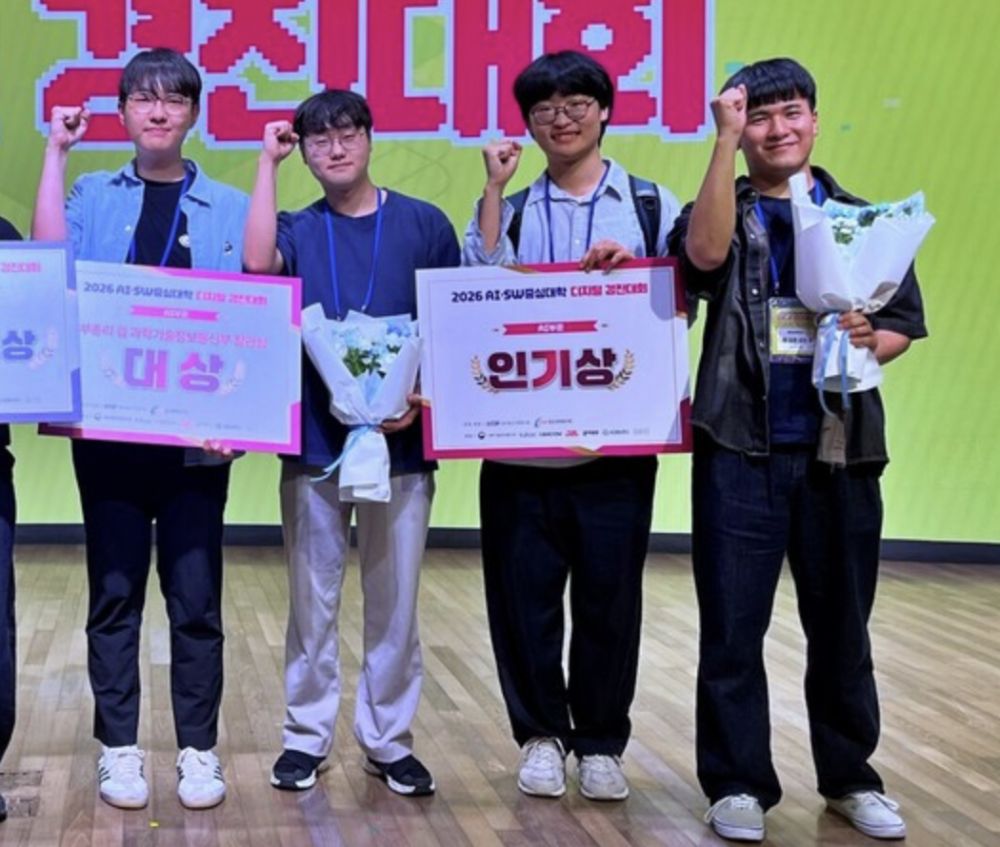
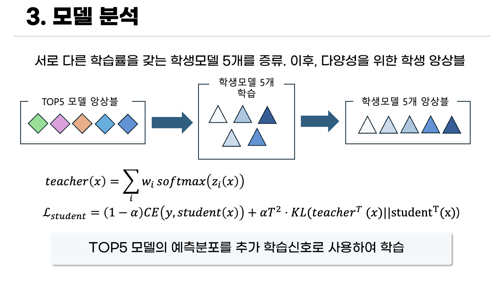

<p align="center">
  
</p>

# 2026 AI·SW중심대학 디지털 경진대회 : AI부문
## 0. 최종 결과(대상, 부총리상)



- **본선 1위(대상, 부총리상)**
- **인기상**
- [발표 자료 보기](./assets/발표자료.pdf)


## 1. 예선 최종 스코어 (2026.07.15 마감일 기준)

<p align="center">
  
</p>

- **Private LB 1위**
- **최종 점수: 0.798786666**
- 팀명: **너만 오면 오인 큐**

## 2. 팀 멤버

<table>
  <tr>
    <td align="center">
      <a href="https://github.com/dev-jake-kim">
        
        <br />
        <sub><b>김진수</b></sub>
        <br />
        <sub>팀장 · 추론 최적화</sub>
        <br />
        <sub>@dev-jake-kim</sub>
        <br/>
        <sub>jake.sw.engineer@gmai.com</sub>
      </a>
    </td>
    <td align="center">
      <a href="https://github.com/baeksuenang">
        
        <br />
        <sub><b>백성현</b></sub>
        <br />
        <sub>seed variance 개선</sub>
        <br />
        <sub>@baeksuenang</sub>
        <br/>
        <sub>jbaegs409@gmail.com</sub>
      </a>
    </td>
    <td align="center">
      <a href="https://github.com/Talusor">
        
        <br />
        <sub><b>이태호</b></sub>
        <br />
        <sub>입력 구조화</sub>
        <br />
        <sub>@Talusor</sub>
        <br/>
        <sub>aakmods@gmail.com</sub>
      </a>
    </td>
    <td align="center">
      <a href="https://github.com/hyundoria">
        
        <br />
        <sub><b>이현석</b></sub>
        <br />
        <sub>도메인 적응 & 모델 압축</sub>
        <br />
        <sub>@hyundoria</sub>
        <br/>
        <sub>hyundoria@gmail.com</sub>
      </a>
    </td>
  </tr>
</table>

## 3. 대회 개요

| 항목 | 내용 |
| --- | --- |
| 주제 | AI Agent 행동(Action) 의사결정 예측 챌린지 |
| 문제 유형 | AI 코딩 에이전트 세션 상태 기반 14-class action classification |
| 입력 정보 | 현재 사용자 발화, 직전까지의 대화·행동 이력, 세션 메타정보 |
| 주요 제한 | 추론 10분 이하, 제출 파일 1GB 이하 |

## 4. 접근 전략

```plain text
1. mmBERT-small 기반 14-class agent action 분류 baseline 구축
2. 현재 사용자 의도와 이전 행동/결과/세션 상태를 분리한 BERT pair 입력 설계
3. long-context 입력, TAPT, R-Drop, EMA, label smoothing으로 단일 모델 성능 개선
4. seed 탐색 및 softmax 평균 앙상블로 정체 구간 돌파
5. 지식증류(KD)로 앙상블 지식을 단일 모델에 압축
6. delta 압축, vocab pruning, embedding freeze로 1GB 제출 제한 대응
7. progressive early-exit과 동적 배칭으로 최종 앙상블 추론 시간 단축
```

- 이 대회는 단순 intent classification이 아니라, 대화의 현재 상태와 직전 도구 실행 결과를 함께 보고 다음 agent action을 예측하는 문제로 접근했다.
- 같은 사용자 발화라도 세션 단계에 따라 필요한 행동이 달라질 수 있으므로, 현재 프롬프트와 과거 상태를 하나의 문자열로 합치지 않고 `text1/text2` pair 입력으로 분리했다.
- 최종적으로는 자체 long-context 계열 5개 모델과 팀원 pair-input 계열 3개 모델을 결합한 하이브리드 앙상블을 사용했다.
- 제출 용량과 추론 시간 제한이 있었기 때문에, 성능 개선뿐 아니라 모델 패키징과 추론 파이프라인 최적화도 중요한 축으로 다뤘다.

## 5. 주요 제출 결과

| 제출번호 | 파일 | 추론 시간 | 점수 | 비고 |
| --- | --- |  --- | --- | --- |
| 34837 | `fast_final.zip` | 5분 14초 | **0.798786666** | 최종 제출, 추론 최적화 적용 |
| 34531 | `gen14_900011.zip` | 1분 52초 | 0.7970027741 | 최종 순위기준 9-10위, 본선진출자 중 내 encoder기반 단일 모델중 최고성능/최속성능 |
| 28346 | `submit.zip` |  1분 29초 | 0.7830539834 | 최초 베이스라인 |

## 6. 단일 모델 Architecture

### 6-1) 최초 베이스라인

- `jhu-clsp/mmbert-small` 기반 14-class 행동 예측 모델이다.
- 현재 사용자 프롬프트뿐 아니라 직전 agent 행동, 실행 결과, 작업공간 상태, 열린 파일 목록, 최근 action sequence를 함께 사용했다.
- 입력은 현재 의도(`text1`)와 이전 행동/세션 문맥(`text2`)을 분리한 BERT pair 구조로 구성했다.
- 초기 모델은 CV macro-F1 약 `0.782`를 기록했고, 운영진측 베이스라인 `0.427` 대비 큰 폭으로 개선되었다.
<details>
<summary>입력 예시(눌러서 확인)</summary>
<br>

```text
<TURN_4>
<CUR> 이제 parser 테스트만 한번 돌려봐 가볍게 </CUR>
<PREV_USER> command이 sh -c로 감싸는구나... 이거 인젝션 표면이네. 실제 동작 한번만 찍어보자
</PREV_USER>
[SEP]
<LAST_ACTION> <A_RUN_TESTS> </LAST_ACTION>
<LAST_RESULT> <RESULT_FAILED> <HAS_TEST_FAIL> FAIL: 191 tests failing </LAST_RESULT>
<LAST_ARGS> path=tests/Button.test.tsx ext=tsx pattern=none cmd=<CMD_UNKNOWN>
</LAST_ARGS>

<PREV_ACTION> <A_EDIT_FILE> </PREV_ACTION>
<ACTION_SEQ> <A_READ_FILE> <A_EDIT_FILE> <A_RUN_TESTS> </ACTION_SEQ>

<OPEN_FILES> package.json </OPEN_FILES>
<PROMPT_FEATURE> <P_WORD_RUN> <P_WORD_TEST> </PROMPT_FEATURE>
<SESSION_FEATURE> <DIRTY_TRUE> <CI_FAILED> <OPEN_SOME> turn=4 history=6 actions=3
loc=58700 budget=70033 primary_lang=ts open_exts=json </SESSION_FEATURE>
```

</details>

### 6-2) long-context 확장

기존 입력은 직전 action 1건의 결과만 담고 있어, 세션이 진행될수록 "지금 상태에 이르기까지의 누적된 흐름"을 볼 수 없었다. long-context 확장은 필드별 절단 한도를 완화하고, 과거 실행 결과 블록을 새로 추가한 것이다.

| 상수 | baseline | long-context | 의미 |
| --- | --- | --- | --- |
| `HISTORY_RESULTS_N` | **0** | **6** | 과거 action 결과 블록 (신설) |
| `OPEN_FILES_COUNT` | 8 | 24 | 열린 파일 목록 개수 |
| `ACTION_SEQ_LEN` | 12 | 24 | action 이름 시퀀스 길이 |
| `MAX_RESULT_CHARS` | 220 | 600 | 직전 결과 원문 절단 |
| `MAX_PREV_USER_CHARS` | 320 | 800 | 직전 사용자 발화 절단 |
| `MAX_OPEN_FILES_CHARS` | 360 | 1,200 | 열린 파일 목록 절단 |
| `MAX_ARG_CHARS` | 160 | 320 | action 인자 절단 |

핵심 변화는 한도 완화가 아니라 **`<HISTORY_RESULTS>` 블록의 신설**이다.

- baseline은 `HISTORY_RESULTS_N = 0`이라 이 블록이 입력에서 **통째로 빠져 있었다**.
- `<LAST_RESULT>`가 이미 담고 있는 마지막 1건은 제외하고, 그 이전 최근 6건의 action 이름 + 결과 원문을 추가한다.
- 학습 데이터 70,000행 중 **52,203행(74.58%)** 에서 이 블록이 실제로 생성된다(action이 2건 이상 쌓인 시점).

즉 baseline은 데이터의 약 4분의 3에서 "누적된 실행 흐름"이라는 정보 자체에 접근할 수 없었고, long-context 모델이 처음으로 이를 보게 되었다.

<details>
<summary>과거 정보를 담는 세 블록의 역할 분담(눌러서 확인)</summary>
<br>

| 블록 | 담는 것 | baseline |
| --- | --- | --- |
| `<LAST_ACTION>` / `<LAST_RESULT>` | 가장 최근 action **1건**의 이름과 결과 원문 | 있음 |
| `<ACTION_SEQ>` | 최근 N건의 action **이름만** 나열 (결과 없음) | 있음 (12건) |
| `<HISTORY_RESULTS>` | 마지막 1건을 제외한 최근 6건의 **이름 + 결과 원문** | **없음** |

`<ACTION_SEQ>`가 "무엇을 했는지"의 저비용 요약(뼈대)이라면, `<HISTORY_RESULTS>`는 "그래서 어떤 결과가 나왔는지"를 붙여주는 고비용 상세 정보다. long-context는 이 둘을 함께 강화했다.

</details>

- 실제 입력 토큰 길이는 중앙값 228, 최대 383으로 `max_length` 한도에 도달하지 않는다. 성능 변화를 만든 것은 시퀀스 길이 확장이 아니라 **입력에 포함된 정보량 자체**였다.
- 최종 앙상블에서는 short context 계열과 long context 계열을 함께 사용해, 단기 관점과 장기 관점을 상호 보완했다.

### 6-3) 정규화

단일 모델 성능이 정체된 구간에서 계산·오버샘플링·후처리 축이 모두 실패한 뒤, **표현 자체를 바꾸는 TAPT와 학습을 안정화하는 R-Drop만이 유효**했다. 두 기법 도입으로 3-seed 앙상블 CV가 `0.7788 → 0.7862` (**+0.74%p**), LB **0.7876**으로 개선되었다.

**TAPT — 과제 적응 사전학습**

- 분류 fine-tuning 이전에, 대회 데이터의 텍스트만으로 MLM을 이어서 학습해 backbone을 태스크 도메인에 적응시킨다 (Gururangan et al., *Don't Stop Pretraining*, ACL 2020).
- 분류 단계와 **동일한 직렬화**로 코퍼스를 구성해, 새로 추가한 특수 토큰이 사전학습 단계에서부터 문맥을 획득하도록 했다.
- 라벨을 전혀 사용하지 않는 자기지도 단계이므로, 라벨 유출 없이 데이터 텍스트를 활용할 수 있다.
- `tapt_epochs=2`. 첫 시드에서 1회만 실행한 뒤 backbone을 캐시해 이후 모든 시드가 공유한다 — 시드당 약 13분을 절약하는 동시에, 시드 간 embedding 차이를 0으로 유지해 후술할 delta 압축의 전제가 된다.

**R-Drop — 드롭아웃 일관성 정규화**

- 같은 배치를 dropout mask만 다르게 하여 두 번 forward하고, 두 예측 분포가 어긋난 정도를 KL로 벌점화한다 (Liang et al., NeurIPS 2021).
- 학습 시(dropout on)와 추론 시(dropout off)의 동작 불일치를 좁혀, 특수 토큰에 대한 과적합을 억제한다.

$$\mathcal{L} = \frac{1}{2}\left[\mathrm{CE}(y, p_1) + \mathrm{CE}(y, p_2)\right] + \alpha \cdot \frac{1}{2}\left[\mathrm{KL}(p_1 \parallel p_2) + \mathrm{KL}(p_2 \parallel p_1)\right]$$

- KL은 **양방향(대칭)** 으로 계산한다. 두 dropout mask 중 어느 쪽도 정답 기준이 될 이유가 없기 때문이다.
- `rdrop_alpha`는 민감도가 크다. 0.5에서 **-0.66%p**, 1.5에서 **-0.79%p**로 양쪽 모두 악화되어, **α = 1.0이 유일한 최적점**임을 단일 변수 스윕으로 확인했다.

**함께 적용한 정규화**

| 기법 | 설정 | 목적 |
| --- | --- | --- |
| EMA | decay 0.999 | 학습 궤적의 시간 평균으로 분산 감소 |
| label smoothing | 0.1 | 과확신 억제 |
| weighted CE | `class_weight_power=0.5` | 클래스 불균형 대응 (역빈도의 sqrt 완화) |
| freeze-base-embeddings | 원본 vocab 256,000행 동결 | 특수 토큰 109행만 학습 |

> `freeze-base-embeddings` 구현 시, gradient hook만으로는 AdamW의 decoupled weight decay가 gradient와 무관하게 파라미터를 계속 감쇠시켜 동결이 새는 문제가 있었다. `no_decay` 파라미터 그룹을 분리해 완전 동결(변화량 정확히 0.0)을 검증했다.

## 7. 대회 제약사항에 따른 모델 학습 및 추론

### 7-1) 지식증류

- 앙상블 모델 개수를 선형적으로 늘릴 경우 용량/시간적 제한을 넘어서므로 여러 모델을 하나로 압축시켜 seed variance를 감소시켰다.
<details>
<summary>증류 예시(눌러서 확인)</summary>
<br>

</details>

### 7-2) Delta 기반 앙상블 압축

- 용량 제한 안에 모델을 넣기 위해, 전체 checkpoint를 저장하지 않고 `base + delta` 구조로 압축했다.

|  | 적용 전 | 적용 후 | 비고 |
| --- | --- | --- | --- |
| 용량 | 1.8Gb | 0.88Gb | 약 57%감소 |

### 7-3) 델타친화 웜스타트 증류

`gen14`(14-teacher 증류)는 단독 LB **0.797**로 최고 성능의 단일 모델이었으나, base 모델과 가중치 거리가 멀어 **delta 압축이 되지 않아 용량 한도에 들어가지 못했다.**

이를 해결하기 위해, 새로 학습하는 대신 **이미 완성된 checkpoint에서 전체 가중치(분류 헤드 포함)를 warm-start**한 뒤 낮은 학습률(`lr=1e-5`)로 증류만 추가 학습했다.

- 임베딩은 freeze되어 있어 출발점과 정확히 0 차이가 유지된다.
- 나머지 파라미터도 저LR 덕분에 출발점 근처에 머물러, delta가 형제 시드 수준으로 작게 유지된다.

| delta | 압축률 | 비고 |
| --- | --- | --- |
| 독립 학습 시드 (seed 5 / 16 / 24) | 4.04배 | 각자 독립적으로 학습 |
| **웜스타트 시드 (seed 781)** | **6.74배** | base가 이 checkpoint에서 warm-start됨 |

성능을 유지하면서 압축 가능한 형태로 만들어, 최종 8모델 조합을 용량 한도 안에 담을 수 있었다.

### 7-4) 병렬처리
 - 모델추론: GPU consumming job
 - 모델 압축 해제: CPU consumming job
 - 위 두 과정 병렬처리
### 7-5) Progressive Early-Exit
 - 앙상블 과정에서 지금까지 실행된 모델의 확률을 합산시 margin (1위 클래스 –2위 클래스확률차) > remaining weight (남은 모델 가중치 합) 이면 조기 종료

### 7-6) 길이 기반 동적 배칭

Transformer 배치 추론은 **배치 내 최장 샘플 길이에 맞춰 전체가 패딩**되므로, 입력 길이 편차가 클수록 패딩 연산이 낭비된다. 이 데이터의 토큰 길이는 중앙값 228, 평균 221, 표준편차 52, 최대 383으로, 원본 순서로 64개씩 묶으면 대부분의 배치가 330~355 토큰까지 패딩되었다.

**개선 방식**

1. 직렬화·토크나이즈를 **1회만** 수행하고, 패딩 없이 실제 토큰 길이를 확보한다. (이 결과는 앙상블의 모든 멤버가 재사용한다)
2. 길이 **내림차순으로 정렬**해 비슷한 길이의 샘플이 같은 배치에 모이게 한다.
3. "고정 개수"가 아니라 **토큰 예산** 기준으로 배치를 가변 구성한다.

```text
배치 크기 × 배치 내 최장 길이  ≤  batch_size × max_length
```

4. 추론 후 원래 순서로 복원한다.

토큰 예산을 `batch_size × max_length`, 즉 **기존 고정 배치가 최악의 경우 사용하는 메모리와 동일한 값**으로 설정했다. 이로써 기존 설정과 같은 메모리 상한을 보장하면서 배치 크기만 가변화할 수 있다.

**측정 결과 (고정 검증셋 7,000행)**

|  | 고정 배치 (64) | 길이정렬 동적 배치 |
| --- | --- | --- |
| 배치 수 | 110 | **29** |
| 패딩 포함 토큰 | 2,252,928 | **1,584,292** |
| 패딩 낭비 | 31.2% | **2.2%** |

- 배치 크기는 95~256 사이에서 가변한다. 긴 샘플 구간에서는 토큰 예산이, 짧은 샘플 구간에서는 배치 개수 상한이 제약으로 작용한다.
- 스텝 수는 3.79배, 패딩을 포함한 실제 연산량은 1.42배 감소한다. 전자는 커널 실행 오버헤드를, 후자는 순수 연산량을 줄인다.
- 함께 적용한 최적화로, 앙상블 멤버를 교체할 때 모델을 새로 생성하지 않고 `load_state_dict`로 가중치만 교체해 디스크 I/O와 객체 초기화 반복을 제거했다.

> **정확성**: 이 모델은 LayerNorm 기반이라 정규화가 샘플별로 독립적이고, 패딩 토큰은 attention mask로 배제된다. 따라서 배치 구성이 달라져도 예측 결과는 동일하다. (BatchNorm 계열이었다면 배치 구성이 결과를 바꾸므로 적용할 수 없는 기법이다.)


## 8. 참고

- 공식 대회 링크: [DACON 2026 AI·SW중심대학 디지털 경진대회 : AI부문](https://dacon.io/competitions/official/236694/overview/description)
## 9. 포스터

