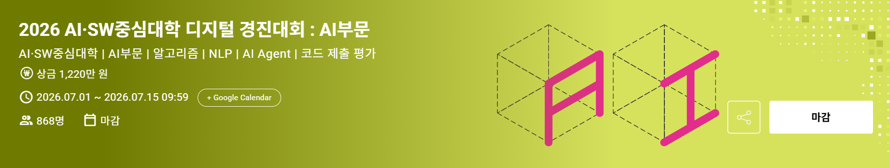
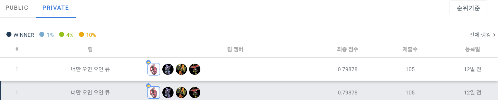

<p align="center">
  
</p>

# 2026 AI·SW중심대학 디지털 경진대회 : AI부문

## 1. 최종 스코어 (2026.07.15 마감일 기준)

<p align="center">
  
</p>

- **Private 1위**
- **최종 점수: 0.798786666**
- 팀명: **너만 오면 오인 큐**
- 제출 수: **105회**

## 2. 팀 멤버

<table>
  <tr>
    <td align="center">
      <a href="https://github.com/dev-jake-kim">
        
        <br />
        <sub><b>김진수</b></sub>
        <br />
        <sub>팀장 · 추론 최적화</sub>
        <br />
        <sub>@dev-jake-kim</sub>
      </a>
    </td>
    <td align="center">
      <a href="https://github.com/baeksuenang">
        
        <br />
        <sub><b>백성현</b></sub>
        <br />
        <sub>seed variance 개선</sub>
        <br />
        <sub>@baeksuenang</sub>
      </a>
    </td>
    <td align="center">
      <a href="https://github.com/Talusor">
        
        <br />
        <sub><b>이태호</b></sub>
        <br />
        <sub>입력 구조화</sub>
        <br />
        <sub>@Talusor</sub>
      </a>
    </td>
    <td align="center">
      <a href="https://github.com/hyundoria">
        
        <br />
        <sub><b>이현석</b></sub>
        <br />
        <sub>도메인 적응력 개선</sub>
        <br />
        <sub>@hyundoria</sub>
      </a>
    </td>
  </tr>
</table>

## 3. 대회 개요

| 항목 | 내용 |
| --- | --- |
| 대회명 | 2026 AI·SW중심대학 디지털 경진대회 : AI부문 |
| 주제 | AI Agent 행동(Action) 의사결정 예측 챌린지 |
| 문제 유형 | AI 코딩 에이전트 세션 상태 기반 14-class action classification |
| 입력 정보 | 현재 사용자 발화, 직전까지의 대화·행동 이력, 세션 메타정보 |
| 평가 지표 | Macro-F1 |
| 제출 방식 | `script.py`와 학습된 모델을 포함한 `submit.zip` 코드 제출 |
| 실행 환경 | T4 GPU 16GB VRAM, 3 vCPU, 12GB RAM, 오프라인 실행 |
| 주요 제한 | 추론 10분 이하, 패키지 설치 10분 이하, 제출 파일 1GB 이하 |

- 사용자의 요청과 현재 세션 상태를 바탕으로, 에이전트가 다음에 수행할 행동을 빠르고 정확하게 예측하는 것이 목표였다.
- 예측 대상은 파일 읽기, 검색, 수정, 셸 명령 실행, 테스트 실행, 사용자 질문 등 실제 코딩 에이전트의 주요 행동 14개 클래스로 구성되었다.
- 대회 기간은 예선 기준 2026.07.01 10:00부터 2026.07.15 10:00까지였고, 예선 결과 발표는 2026.07.27 14:00로 공지되었다.

## 4. 접근 전략

```plain text
1. mmBERT-small 기반 14-class agent action 분류 baseline 구축
2. 현재 사용자 의도와 이전 행동/결과/세션 상태를 분리한 BERT pair 입력 설계
3. long-context 입력, TAPT, R-Drop, EMA, label smoothing으로 단일 모델 성능 개선
4. seed 탐색 및 softmax 평균 앙상블로 정체 구간 돌파
5. 지식증류(KD)로 앙상블 지식을 단일 모델에 압축
6. delta 압축, vocab pruning, embedding freeze로 1GB 제출 제한 대응
7. progressive early-exit과 동적 배칭으로 최종 앙상블 추론 시간 단축
```

- 이 대회는 단순 intent classification이 아니라, 대화의 현재 상태와 직전 도구 실행 결과를 함께 보고 다음 agent action을 예측하는 문제로 접근했다.
- 같은 사용자 발화라도 세션 단계에 따라 필요한 행동이 달라질 수 있으므로, 현재 프롬프트와 과거 상태를 하나의 문자열로 합치지 않고 `text1/text2` pair 입력으로 분리했다.
- 최종적으로는 자체 long-context 계열 5개 모델과 팀원 pair-input 계열 3개 모델을 결합한 하이브리드 앙상블을 사용했다.
- 제출 용량과 추론 시간 제한이 있었기 때문에, 성능 개선뿐 아니라 모델 패키징과 추론 파이프라인 최적화도 중요한 축으로 다뤘다.

## 5. 주요 제출 결과

| 제출번호 | 파일 | 설명 | 추론 시간 | 점수 | 비고 |
| --- | --- | --- | --- | --- | --- |
| 34837 | `fast_final.zip` | progressive ours+team, team GPU cache, delta prefetch, exact-output transformations | 5분 14초 | **0.798786666** | 최종 제출, 추론 최적화 적용 |
| 34645 | `hybrid23.zip` | hybrid23_deltakd_pruned | 7분 42초 | **0.798786666** | 최종 조합 |
| 34531 | `gen14_900011.zip` | 14-teacher 분포 증류 단일 모델 | 1분 52초 | 0.7970027741 | 단일 모델 최고 성능 |
| 33972 | `hybrid21.zip` | hybrid21_tokenbudget | 6분 59초 | 0.7986394575 | 최고점 유지 구간 |
| 33333 | `hybrid13.zip` | ours 4개 전체 데이터 재학습 + 그룹 가중치 0.675:0.325 | 8분 14초 | 0.7983659052 | 리더보드 1등 첫 등극 |
| 32593 | `hybrid10.zip` | ours781+5+16+24 + team distill1002+1003+1005 | 9분 46초 | 0.797529788 | KD 학생이 정규 멤버로 채택된 지점 |
| 32322 | `hybrid5.zip` | ours seed5+6 + team seed114/172/123 | 7분 9초 | 0.7939716837 | 이종 하이브리드 앙상블 최초 성공 |
| 31251 | `submit.zip` | delta ensemble top5 seeds=[106, 114, 123, 135, 160] | 7분 41초 | 0.7939438539 | 자동 seed 탐색 및 앙상블 |
| 30168 | `submit_best5.zip` | exp042 best5 delta ensemble | 6분 57초 | 0.7899206928 | 앙상블 첫 시작 |
| 28346 | `submit.zip` | mmBERT 기반 초기 모델 | 1분 29초 | 0.7830539834 | 대태호 모델 |

## 6. 모델별 실험 정리

### 6-1) 대태호 모델

- `jhu-clsp/mmbert-small` 기반 14-class 행동 예측 모델이다.
- 현재 사용자 프롬프트뿐 아니라 직전 agent 행동, 실행 결과, 작업공간 상태, 열린 파일 목록, 최근 action sequence를 함께 사용했다.
- 입력은 현재 의도(`text1`)와 이전 행동/세션 문맥(`text2`)을 분리한 BERT pair 구조로 구성했다.
- 초기 모델은 CV macro-F1 약 `0.782`를 기록했고, TF-IDF baseline `0.427` 대비 큰 폭으로 개선되었다.

### 6-2) long-context 확장

| 항목 | baseline | long-context |
| --- | --- | --- |
| `max_length` | 512 | 1024 |
| 결과 이력 | `<LAST_RESULT>` 최근 1개 | 최근 결과 최대 6개 |
| 결과 텍스트 예산 | 짧은 단일 결과 | 600자 |
| 열린 파일 목록 | 기본 목록 | 24개 / 1200자 예산 |

- 실제 세션에서는 몇 턴 전의 테스트 실패나 도구 결과가 다음 행동 판단에 영향을 주는 경우가 많았다.
- long-context 버전은 최근 결과 이력을 더 넓게 보게 만들어, 탐색-수정-검증으로 이어지는 작업 흐름을 더 안정적으로 학습하도록 했다.

### 6-3) TAPT와 R-Drop

- TAPT(Task-Adaptive Pretraining)는 대회 코퍼스로 Masked Language Modeling을 추가 수행해 mmBERT를 agent session log 분포에 적응시키는 단계다.
- 새로 추가한 special token 109개를 phrase-mean embedding으로 초기화한 뒤, TAPT로 실제 문맥에 맞게 조정했다.
- 최종 설정은 `TAPT 2 epochs`, `R-Drop alpha=1.0`이었다.
- R-Drop은 같은 입력을 dropout mask만 다르게 두 번 forward하고, 두 출력 분포가 가까워지도록 대칭 KL loss를 더하는 방식으로 적용했다.

### 6-4) Delta 기반 앙상블 압축

- 제출 ZIP 용량 1GB 제한 안에 여러 seed 모델을 넣기 위해, 전체 checkpoint를 반복 저장하지 않고 `base + delta` 구조로 압축했다.

```plain text
theta_target = theta_base + delta_target
delta_target = theta_target - theta_base
```

- 실제 데이터에서 사용된 token ID만 남기는 vocab pruning을 함께 적용했다.
- 전체 vocabulary 256,104개 중 실제 사용 token은 9,848개로 약 3.8%였고, embedding table을 줄여 base와 delta 크기를 동시에 낮췄다.
- 5모델 구성은 약 816MB였고, 7모델 구성은 약 648.5MB까지 줄어 모델 수를 늘리면서도 최종 ZIP 크기를 낮출 수 있었다.

### 6-5) 지식증류(KD)

- 당시 최고 하이브리드 앙상블의 softmax 확률분포를 teacher로 삼아 단일 학생 모델을 학습했다.

```plain text
Loss = (1 - alpha) * CE(hard label)
     + alpha * T^2 * KL(teacher distribution || student distribution)

alpha = 0.5
T = 2.0
```

- 14개 teacher 모델의 확률을 균등 평균한 `gen14_900011`은 단일 모델로 0.7970027741을 기록했다.
- 다만 base 모델과 가중치 거리가 커져 delta 압축이 어려웠기 때문에, 최종 제출에서는 강한 학생을 그대로 넣는 대신 delta-friendly warm-start 증류 전략을 사용했다.
- 최종적으로 seed781에서 warm-start한 KD 학생(seed7810)을 기존 ours 멤버에 추가해 8모델 최종 조합을 만들었다.

### 6-6) 추론 최적화

- `fast_final.zip`은 8개 모델 가중 앙상블의 최종 예측을 유지하면서 불필요한 추론을 제거한 제출물이다.
- 핵심은 sample별 `margin > remaining weight` 조건을 이용한 progressive early-exit이다.
- 남은 모델들이 현재 2위 클래스에 최대 확률을 주더라도 1위가 뒤집히지 않는 샘플은 이후 추론 대상에서 제외했다.

```plain text
최종 확률 = ours 평균 * 0.675 + team 평균 * 0.325
```

- ours 그룹은 5개 모델, team 그룹은 3개 모델로 구성했다.
- 30,000개 train 샘플 기준 원본 추론 시간은 약 101초였고, 최적화 후 약 67초로 줄어 약 33% 단축되었다.

## 7. 후기

- 이번 대회에서 가장 중요했던 점은 모델 성능, 제출 용량, 추론 시간의 균형이었다.
- 단일 모델 성능을 올리는 실험만으로는 한계가 있었고, seed 다양성, 이종 파이프라인 조합, 지식증류, 압축, 추론 최적화가 맞물리면서 최종 점수에 도달했다.
- 특히 KD는 "앙상블만큼 강한 단일 모델"을 만드는 용도보다, 용량 예산 안에서 앙상블 멤버 하나를 더 추가하는 도구로 사용할 때 가장 효과적이었다.
- 선택편향, teacher 재사용, 이종 증류 손실, delta 압축 불가능성 같은 실패 지점을 직접 확인하고 우회한 과정이 최종 1위 조합으로 이어졌다.

## 8. 참고

- 공식 대회 링크: [DACON 2026 AI·SW중심대학 디지털 경진대회 : AI부문](https://dacon.io/competitions/official/236694/overview/description)
- 정리 기준: [2026 AI·SW중심대학 디지털 경진대회 Notion](https://app.notion.com/p/2026-AI-SW-39e7588416928046b192e7d044dd6740)
